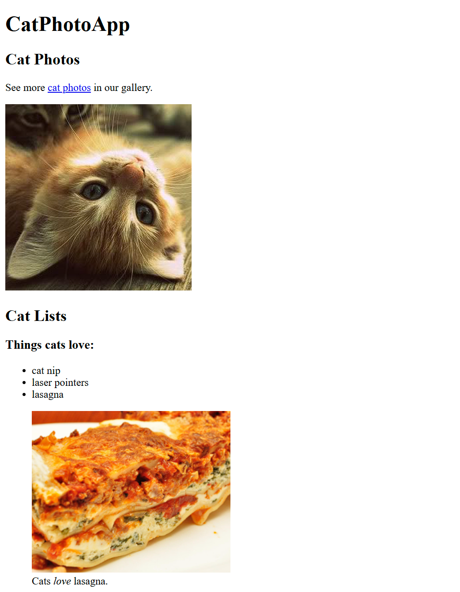
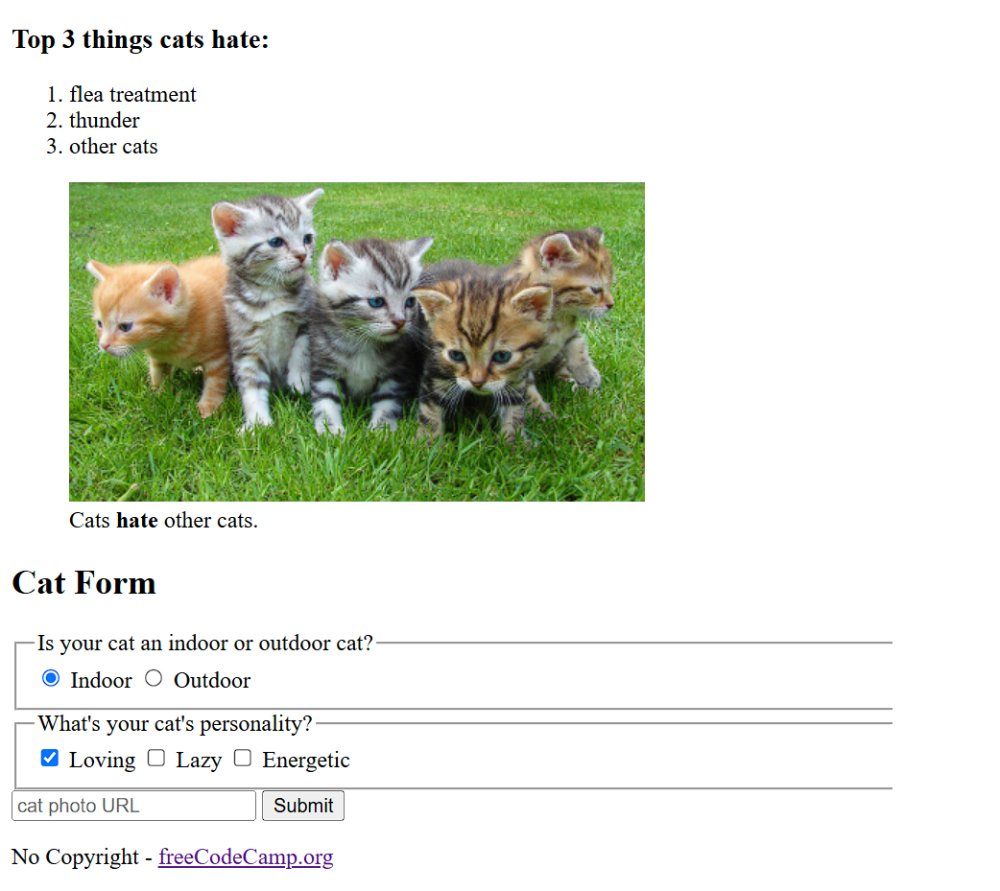

# 🐱 Cat Photo App

A simple HTML-only project built as part of the [Responsive Web Design](https://www.freecodecamp.org/learn/2022/responsive-web-design/learn-html-by-building-a-cat-photo-app/step-1) course on freeCodeCamp.

## 📸 Project Overview

This is a beginner-friendly web page that:

- Displays cat photos
- Shows lists of things cats like and hate
- Includes a form to submit cat info

## 💡 Technologies Used

- HTML5 only (no CSS or JavaScript)

## ▶️ How to Use

1. Download or clone the repo  
2. Open the `index.html` file in your browser

## 🎓 Source

This project is based on the freeCodeCamp challenge:  
[Learn HTML by Building a Cat Photo App](https://www.freecodecamp.org/learn/2022/responsive-web-design/learn-html-by-building-a-cat-photo-app/step-1)

## 📄 License

This project is part of the [freeCodeCamp.org](https://www.freecodecamp.org) curriculum and is publicly available under the [Creative Commons Zero v1.0 Universal License](https://creativecommons.org/publicdomain/zero/1.0/).
